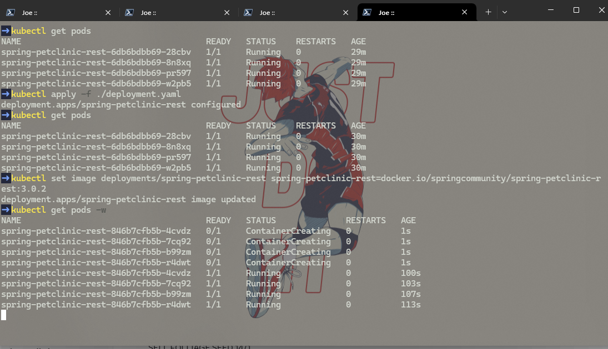

## Joe Mathew Rusli
## 2306152310 / Adpro A

## Refleksi Hello Minikube

1.  Setelah aplikasi diexpose sebagai service dan diakses beberapa kali, log aplikasi menunjukkan peningkatan jumlah log. Setiap kali aplikasi dibuka atau diakses melalui service, server HTTP akan mencatat request GET yang masuk. Hal ini terlihat jelas pada log di mana setiap akses ke endpoint `/` akan menghasilkan baris log baru. Dengan demikian, semakin sering aplikasi diakses, semakin banyak pula log yang tercatat, yang menandakan bahwa service berhasil meneruskan request ke Pod aplikasi.

#### Before Expose


#### After Expose


2.  Opsi `-n` pada perintah `kubectl get` digunakan untuk menentukan namespace dari resources Kubernetes yang ingin ditampilkan. Ketika perintah `kubectl get pods` atau `kubectl get services` dijalankan tanpa opsi `-n`, secara default Kubernetes akan menampilkan sumber daya dari namespace `default`. Ini adalah namespace tempat resource yang kita buat secara eksplisit seperti deployment `hello-node` dan servicenya berada. Sebaliknya, ketika perintah `kubectl get pods -n kube-system` dijalankan, Kubernetes akan menampilkan pods yang berjalan di dalam namespace `kube-system`. Namespace `kube-system` adalah tempat komponen-komponen sistem Kubernetes itu sendiri berjalan, seperti komponen control plane, DNS, dan lainnya. Oleh karena itu, output dari perintah dengan `-n kube-system` tidak akan mencantumkan pods atau services yang kita buat di namespace `default` karena keduanya berada di namespace yang berbeda dan terisolasi satu sama lain.

## Refleksi Rolling Update & Kubernetes Manifest File

1. Perbedaan utama antara strategi deployment Rolling Update dan Recreate terletak pada cara Pod diperbarui. Rolling Update adalah strategi default di Kubernetes. Dalam strategi ini, instance Pod lama secara bertahap digantikan oleh instance Pod baru. Kubernetes memastikan bahwa sejumlah Pod tertentu tetap berjalan dan tersedia selama proses update, sehingga meminimalkan atau bahkan menghilangkan downtime aplikasi. Pod baru dibuat terlebih dahulu, dan setelah dipastikan sehat, Pod lama akan dihentikan. Sebaliknya, strategi Recreate akan mematikan semua Pod versi lama terlebih dahulu sebelum membuat Pod versi baru. Ini berarti akan ada periode downtime di mana aplikasi tidak tersedia sama sekali selama transisi dari versi lama ke versi baru. Strategi Recreate biasanya digunakan jika aplikasi tidak mendukung versi lama dan baru berjalan secara bersamaan atau jika ada perubahan signifikan yang memerlukan penghentian total sebelum versi baru dijalankan.

Berikut adalah langkah-langkah saya untuk mencoba deployment Spring Petclinic REST menggunakan strategi Recreate:
- Langkah 1: Modif File Manifest (`deployment.yaml`)**
Untuk menggunakan strategi Recreate, saya memodifikasi file deployment.yaml. Saya mengubah bagian `spec.strategy` sebagai berikut:
- Ubah type dari RollingUpdate menjadi Recreate.
- Menghapus blok rollingUpdate karena tidak relevan untuk strategi Recreate.

- Langkah 2: Merevisi field pada file manifest
Setelah memodifikasi `deployment.yaml`, saya merevisi field `deployment.kubernetes.io/revision`. 

```yaml
deployment.kubernetes.io/revision: "5"
```

Lalu saya juga menghapus field `resourceVersion` dan `uid` yang tidak diperlukan dalam konteks ini.

- Langkah 3: Memicu update dengan strategi recreate
Setelah mengapply dengan perintah
```bash
kubectl apply -f ./deployment.yaml
```
Untuk benar-benar melihat strategi `Recreate` beraksi, saya perlu memicu sebuah update, misalnya dengan mengubah versi image aplikasi.
```bash
kubectl set image deployments/spring-petclinic-rest spring-petclinic-rest=docker.io/springcommunity/spring-petclinic-rest:3.0.2
```
Amati status Pod selama proses update.
```bash
kubectl get pods -w
```



Kita akan melihat bahwa semua Pod dari deployment `spring-petclinic-rest` dengan image lama akan dihentikan (`Terminating`) terlebih dahulu. Setelah semuanya berhenti, baru Pod dengan image baru akan dibuat (`Pending`, `ContainerCreating`, lalu `Running`). Ini akan menyebabkan downtime singkat.

Kita juga bisa memantau status rollout dengan:
```bash
kubectl rollout status deployments/spring-petclinic-rest
```
Setelah selesai, Kita bisa mengembalikan ke image yang lebih baru jika diinginkan, misalnya:
```bash
kubectl set image deployments/spring-petclinic-rest spring-petclinic-rest=docker.io/springcommunity/spring-petclinic-rest:3.2.1
kubectl rollout status deployments/spring-petclinic-rest
```

4.  Menggunakan file manifest Kubernetes memberikan banyak sekali manfaat dibandingkan dengan mengelola resouce secara manual melalui perintah `kubectl`. Pertama, file manifest bersifat deklaratif, artinya kita mendefinisikan keadaan yang diinginkan dari aplikasi kita, dan Kubernetes akan bekerja untuk mencapai serta mempertahankan keadaan tersebut. Hal ini berbeda dengan perintah manual yang bersifat imperatif, di mana kita harus menentukan langkah demi langkah. Kedua, file manifest memungkinkan adanya version control. Kita dapat menyimpan file yaml ini di sistem kontrol versi seperti Git, yang memfasilitasi pelacakan perubahan, kolaborasi tim, kemudahan untuk rollback, dan audit. Ketiga, manifest mendukung reusabilitas dan konsistensi. Konfigurasi yang sama dapat dengan mudah diterapkan di berbagai environment, misalnya development, staging, production, atau direplikasi, sehingga mengurangi risiko kesalahan manusia dan memastikan konsistensi. Keempat, manifest adalah dasar untuk otomatisasi melalui pipeline CI/CD. Proses deployment dapat diotomatisasi sepenuhnya dengan mengintegrasikan `kubectl apply -f` ke dalam skrip otomatisasi. Jika dibandingkan dengan pengalaman menjalankan perintah `kubectl create deployment`, `kubectl expose`, `kubectl scale`, dan `kubectl set image` secara manual, penggunaan manifest jauh lebih terstruktur, terdokumentasi, dan andal. Perintah manual rentan terhadap kesalahan ketik, sulit untuk dilacak perubahannya secara sistematis, dan mereplikasi setup yang kompleks menjadi sangat merepotkan. Dengan `kubectl apply -f namafile.yaml`, seluruh konfigurasi kompleks dapat diterapkan dengan satu perintah, dan Kubernetes akan menangani perbedaannya (diff) dari state saat ini ke state yang diinginkan.