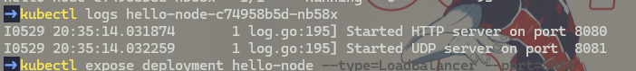
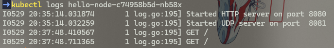

## Joe Mathew Rusli
## 2306152310 / Adpro A

## Refleksi Hello Minikube

1.  Setelah aplikasi diexpose sebagai service dan diakses beberapa kali, log aplikasi menunjukkan peningkatan jumlah log. Setiap kali aplikasi dibuka atau diakses melalui service, server HTTP akan mencatat request GET yang masuk. Hal ini terlihat jelas pada log di mana setiap akses ke endpoint `/` akan menghasilkan baris log baru. Dengan demikian, semakin sering aplikasi diakses, semakin banyak pula log yang tercatat, yang menandakan bahwa service berhasil meneruskan request ke Pod aplikasi.

#### Before Expose

#### After Expose

2.  Opsi `-n` pada perintah `kubectl get` digunakan untuk menentukan namespace dari resources Kubernetes yang ingin ditampilkan. Ketika perintah `kubectl get pods` atau `kubectl get services` dijalankan tanpa opsi `-n`, secara default Kubernetes akan menampilkan sumber daya dari namespace `default`. Ini adalah namespace tempat resource yang kita buat secara eksplisit seperti deployment `hello-node` dan servicenya berada. Sebaliknya, ketika perintah `kubectl get pods -n kube-system` dijalankan, Kubernetes akan menampilkan pods yang berjalan di dalam namespace `kube-system`. Namespace `kube-system` adalah tempat komponen-komponen sistem Kubernetes itu sendiri berjalan, seperti komponen control plane, DNS, dan lainnya. Oleh karena itu, output dari perintah dengan `-n kube-system` tidak akan mencantumkan pods atau services yang kita buat di namespace `default` karena keduanya berada di namespace yang berbeda dan terisolasi satu sama lain.